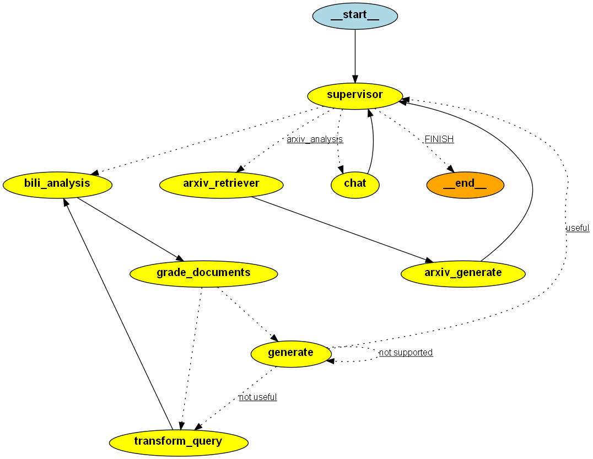

# AI-Agent-Demo

在本项目中，我们实现了一个简单的 `Multi-Agent：多智能体系统`，它能够方便接入多个Agent，同时也可以作为一个聊天机器人与用户进行交互。

## Road Map
  
**当前功能**：

- **Chat**: 对话式的聊天机器人;
- **BiliAgent**: 调用Bili-API查询B站视频信息, 包括名称, 简介, 点赞数, 链接等信息, 然后通过多个Agent进行信息处理, 包括RAG, 内容审查等信息;
- **ArxivAgent**: 调用Arxiv-API查询Arxiv网站论文信息, 包括论文的摘要, 标题, 发表日期等信息, 然后通过Agent对信息进行理解和处理, 并给出用户合理的回答。
  
**后续需要增加**：

- 消息的发送, 利用QQ邮箱等服务
- 联网功能, 获取最新新闻和资讯

## FrameWork

> **目前支持API**：OpenAI在线大模型API调用

**在项目架构方面**，BiliAgent是一个端到端的服务，采用前后端分离架构。后端结合 LangServe 和 FastAPI 技术，利用 LangServe 的 add_routes 接口，将 LangChain 应用中的链和 RAG服务 封装成 REST API，具备高并发请求、流式传输和异步操作的能力。前端界面由 Streamlit 构建，主要聚焦于简洁的用户交互而非复杂的视觉表现。**在技术应用方面**，核心的 AI Agent 框架由 LangGraph 提供支持，基础的模型调用则通过 LangChain 实现，支持目前国内外最热门的 GPT 系列（国外）。
>- **技术**：LangGraph, LangChain, LangServe, FastAPI, Streamlit
>- **AI Agent 框架**: LangGraph
>- **模型调用**: 基于LangChain支持主流的在线& 开源模型
>- **前端技术**: Streamlit
>- **后端技术**: LangServe + FastAPI
>- **嵌入模型**: OpenAI Embedding
>- **状态追踪**: LangSmith

## Project Demonstration
<div align="center">

</div>

## Illustrate Multi-Agent

<div align="center">

</div>
<div align="center">

</div>

## BiliAgent

BiliAgent 是一个基于大模型构建的复杂 AI Agent 应用工具，该应用工具在网页端接收用户输入，后端实时调用 Bilibili API，可以依据用户的输入的问题需求去查询实时数据，得到结果后，自主执行数据分析过程，最终生成精准的回复或数据分析报告，通过前端返回给用户。例如，用户可以在该工具中提出以下需求：

BiliBili热点 & 舆情实时分析智能体

- 我正在学习 Chat GLM 模型的部署，请查找当前哪些相关视频的好评最多，返回当前视频的链接及你推荐的理由
- 我准备发布一个 Swarm 技术相关的视频，请根据当前热门视频的标题和描述，生成一个热门标题，帮助我提升关注度

### 核心功能开发流程图

<div align="center">
  
  </div>
<br>

## 安装指南
```bash
# 克隆仓库
git clone https://github.com/lk-aa/AI-Agent-Demo.git

# 安装依赖
cd Multi-Agent
pip install -r requirements.txt

# 在.env文件中填写OpenAI API Key

# 运行服务端
python ./server.py

# 运行客户端
streamlit run ./client.py
```

## 项目调试说明

通过运行workflow.py文件，可以进行项目的调试。

```bash
python workflow.py
```

## 参考与实践

在 `./reference` 目录中存放了我们项目开展过程中的参考项目与最小实践。