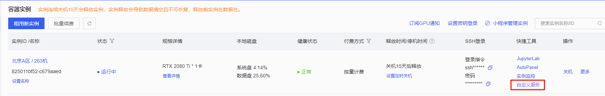
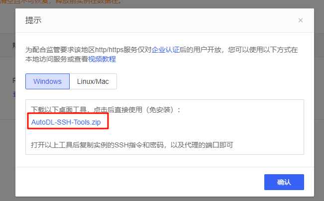
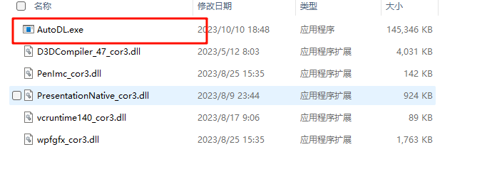
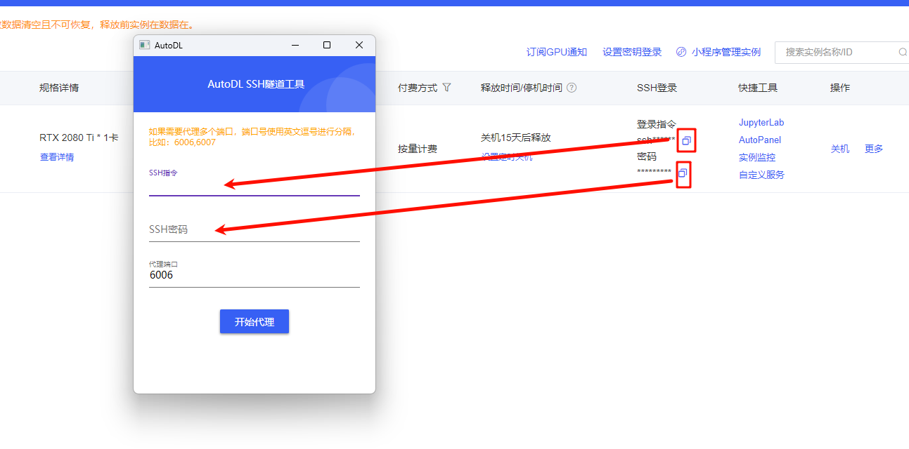
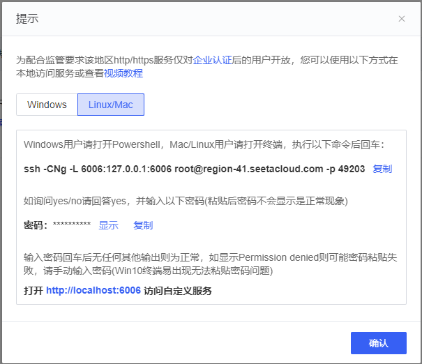

# Project & Study: Minecraft Multi-Agent

在这个文档中，我将详细记录Minecraft Multi-Agent开发的全过程，其中也包括我一步步构建项目时的学习内容。

## Part1: Ollama_study
在这个部分, 我利用Ollama分别在本地Windows系统和云端Linux系统部署了大模型,其中可以使用的模型因算力而有所不同。在Windows系统中，我的电脑显卡为`RTX 3050`,因此部署了3b的模型, 例如`llama3.2:3b`模型。在云端环境中, 我选择了AudoDL作为租赁平台，租用了一卡的`RTX 3090`,其显存为24G,因此我考虑部署了qwen2.5:32b的模型。  
在整个过程中, 利用Ollama进行模型下载和推理使用并不复杂, 但Ollama部署过程中可能相对比较复杂, 尤其是我在Linux系统中部署的时候出现了很多问题。下面我对整个部署过程进行记录：
### **Windows系统**  
在Windows系统中, 我直接从ollama官网下载Windows版本, 然后进行正常安装, 在安装后即可正常地通过命令行使用。常用命令有：
```bash
ollama  
ollama list
ollama run qwen2.5:7b
```
**效果展示：**
<div align="center">

</div>


### **Linux系统** 
在Linux系统中, 不仅更复杂, 也要涉及到如何将AudoDL云端的服务推送到本地环境中运行。  
**Step1: 下载必要依赖项**   
我们首先租赁一个AutoDL平台上的实例。然后通过Jupyter lab打开它, 再进入到它的终端。在终端, 分别依次执行以下命令：
```bash
source /etc/network_turbo   # 开启学术加速
sudo apt-get update
sudo apt-get install lshw
apt-get install systemd -y
apt-get install systemctl -y
curl -fsSL https://ollama.com/install.sh | sh  # 下载ollama
systemctl start ollama.service   # 启动服务
systemctl status ollama.service  # 查看服务启动状态
```

补充：
```bash
# 更新一下apt源并更新
sudo apt-get update && sudo apt-get upgrade -y    
# 安装必要的工具
sudo apt-get install -y wget curl git pciutils lshw
# 下载ollama
curl -fsSL https://ollama.com/install.sh | sh
# 启动 Ollama 服务
# 之前在安装Ollama时，由于在 AutoDL 中没有 systemd，会报systemd not running警告，手动启动 Ollama 服务：
nohup ollama serve > /dev/null 2>&1 &
```

**Step2: 设置ollama的端口和模型保存地址**
由于AutoDL只能开放6006端口，所以我们要想在本地电脑访问到Ollama接口，必须手动设置Ollama端口为6006；同时将Ollama的模型保存地址也修改到autodl-tmp文件夹下。

编辑/etc/profile文件  
```bash
vim /etc/profile
```

首先按G，然后再按o进入编辑模式，在文件底部加入以下内容。
```bash
export OLLAMA_HOST="0.0.0.0:6006"
export OLLAMA_MODELS=/root/autodl-tmp/models

# Custom envirnoment settings
export OLLAMA_MODELS="/root/autodl-tmp/ollama/models"  # 自定义模型路径
export OLLAMA_KEEP_ALIVE="-1"  # 模型最大空闲释放时间，-1为加载后不释放
export OLLAMA_DEBUG="1"  # 日志是否输出调试详情信息
```

接下来按EXC退出编辑模式，输入:wq保存文件。 
然后输入以下命令使得配置生效。  
```bash
source /etc/profile
```

检查配置是否生效。
```bash
echo $OLLAMA_HOST
```


**Step3: 启动Ollama服务**  
我们启动Ollama服务, 命令为  
```bash
ollama serve
```
然后, 再打开一个新的终端, 我们输入以下命令:
```bash
ollama    #测试是否启动了ollama服务
ollama run llama3.2:3b    # 下载模型并运行
```

**Step4: 根据需要关闭学术加速**
```bash
unset http_proxy && unset https_proxy
```

**Step5: 使用python脚本调用API执行**  
Ollama模型默认会开启两个API接口供用户访问。  
http://localhost:6006/api/generate  
http://localhost:6006/api/chat  
想要访问AutoDL的6006端口，还需要在本地开启一个代理。  

回到容器实例页面，然后点击自定义服务  


下载桌面工具：


下载完成后自行解压，打开文件夹中的AutoDL.exe可执行文件。  


然后，输入SSH指令和SSH密码，点击开始代理即可。  


如果是Linux或Mac系统选择后面的版本，安装提示操作即可。


使用以下测试脚本：
```python
url='http://localhost:6006/api/chat'
 
import requests
import json
 
def send_post_request(url, data):
    try:
        headers = {'Content-type': 'application/json'}
        response = requests.post(url, data=json.dumps(data))
        if response.status_code == 200:
            return response.json()
        else:
            print(f"Request failed with status code: {response.status_code}")
            return None
    except requests.exceptions.RequestException as e:
        print(f"Request failed: {e}")
        return None
 
# 请求参数
data = {
    "model": "llama3",
    "messages": [
        {
            "role": "user",
            "content":"who are you?"
                
        }
    ],
    "stream": False
}
 
# 发送 POST 请求并获取响应数据
response_data = send_post_request(url, data)
if response_data:
    # print("Response data:")
    # 提取 content 字段的值
    content = response_data["message"]["content"]
    print(content)
```

运行后得到回复，则说明API调用成功。
